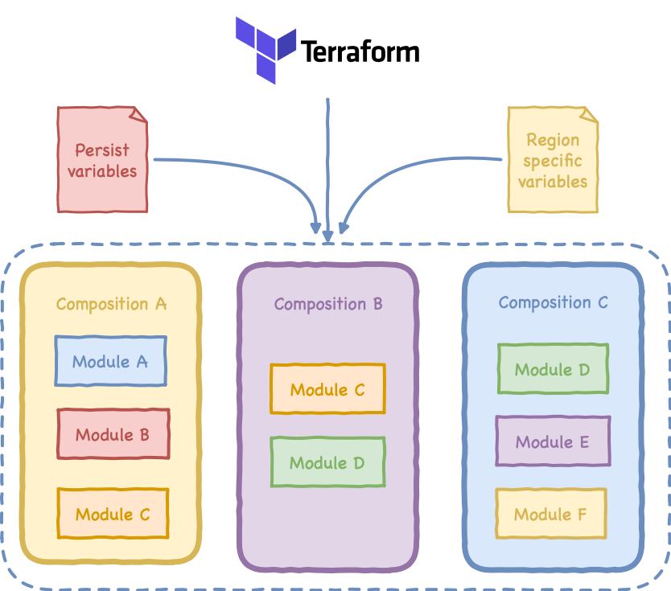

# Terraform Landing Zone

## List of acronyms

* LZ - Landing Zone
* CLZ - Cloud Landing Zone
* AWS - Amazon Web Services

## General Definitions

### What is code for

Deploy a CLZ using Terraform.

### What is a Landing zone

I'll quote [Wikipedia](https://en.wikipedia.org/wiki/Landing_zone) here, when they define a LZ as:

```text
A landing zone (LZ) is an area where aircraft can land.
```

If we translate this to the IT we could rewrite it as:

```text
A landing zone is IT infrastructure to deploy applications.
```

### Why using a Cloud Landing Zone

A CLZ helps users to setup an initial secure and scalable baseline environment using cloud providers design best practices. That environment allow user to quickly get started with a multi-account architecture, identity and access management, governance, data security, network design, and logging.

## Solution Design

### Overview

This solution was designed with simplicity and code cleanliness in mind. Because of that is good to have some knowledge on how is the code structured and what is the content code files type.

Is also very important to mention that this LZ approach is opinionated and is enforcing all CLZ deployed with it to follow those best practices, governance and security. Nevertheless at the end code is just code and everybody should feel free to customise it :)

### Structure



Code is structured around two concepts `Module` and `Composition`:

#### Module

A module is a group of connected resources inherently related to the CLZ. Each Module:

1. Glue different Terraform resources (could be one or multiple)
2. Abstract complexity
3. Do one single task
4. Is not executed by Terraform commands but called from a Composition

#### Composition

Composition is a collection of modules that describes a logical part of the CLZ product. Each composition is:

1. Either global or region specific
2. Executed once in case of the global or multiple times in case of regional
3. Requires at least a persistent variables file in case of global based compositions and an additional region specific variables for regional compositions

#### File content

Below there is a brief description of common files content separated by domain:

* Environments
  * prod (production)
  * stg (staging)
  * dev (development)

* Composition
  * `data.tf`:
  * `resources.tf`
  * `providers.tf`
  * `variables.tf`

* Module
  * `resources.tf`
  * `outputs.tf`
  * `variables.tf`

#### State file

This solution is assuming that the new free [Terraform Cloud Remote State Management](https://www.terraform.io/docs/enterprise/free/) service provided by Hashicorp is used. This is not mandatory by is strongly suggested to use remote state files and never keep it locally.

An additional solution using AWS S3 and Dynamo DB is also possible and will be added.

#### Workspace to organize environments

Following Hashicorp's best practices are following the rule of:

`One Workspace Per Environment Per Terraform Configuration`

Which translates to use a workspace name that reflects `component` and `environment` name.

i.e.: shared-services-dev, shared-services-stg, shared-services-prod

#### Naming convention

Naming convention is one of the main pillars of code consistency in Terraform, using the following rules will make Terraform code clean, consistent and easy to read as well as the final infrastructure objects easily identifiable.

##### Directories

The previously mentioned [structure](#structure) is used as main directory tree. We will differentiate what provider is used in every case as well as creating an additional organization layer for modules:

```text
├── composition
│   └── <PROVIDER_NAME>
│       └── <COMPOSITION_NAME>
└── module
    └── <PROVIDER_NAME>
        └── <PRODUCT_NAME>
            └── <PROVIDER_NAME>
```

Here's a directory example based on AWS only solution:

```text
├── composition
│   └── aws
|       ├── backup_solution
|       ├── shared_services
│       └── 2_tier_app
└── module
    └── aws
        ├── compute
        │   ├── ec2
        |   └── lambda
        ├── database
        |   ├── rds
        |   └── dynamodb
        └── identity
            ├── iam
            └── certificate_manager
```

Here is the list of services for the three major Cloud providers:

* [AWS](https://aws.amazon.com/products/)
* [Google Cloud](https://cloud.google.com/products/)
* [Azure](https://azure.microsoft.com/en-us/services/)

##### Files

Filesystem files are following the next rules:

* Directories are named singular
* Files are named plural
* Only use lower case letters and numbers
* Use the underscore symbol (_) in between words
* File names should be descriptive, such as:
  * `data.tf` to define data sources
  * `locals.tf` to define local variables
  * `modules.tf` to define modules
  * `resources.tf` to define resources
  * `variables.tf` to define variables
  * `providers.tf` to define providers
  * `outputs.tf` to define outputs
  * `values.tfvars` environment variables values

##### Code

* Variables should always have `type` and `description` defined but never defaults, their values should be either explicitly specified or computed
* Do not repeat resource type in resource name:

  ```yaml
  resource "aws_vpc" "vpc" <- WRONG
  ```

  instead use a domain descriptive name such as `public`, `private` or `this`

  ```yaml
  resource "aws_vpc" "this" <- RIGHT
  ```

* Use singular names for resources
* `tags` is always present at the bottom of the resource definition
* `count` and `for_each` are always located at the beginning of the resource definition.
* Use the same variable names, description and default as defined in "Argument Reference" section from the official documentation for the resource you are working on.

## How it works

### Terraform init

```shell
terraform init -backend-config=backend.config
```

### Terraform plan/apply

```shell
terraform plan
```

## Terraform documentation links

[Terraform settings](https://www.terraform.io/docs/configuration/terraform.html)
[AWS Provider](https://www.terraform.io/docs/providers/aws/)
